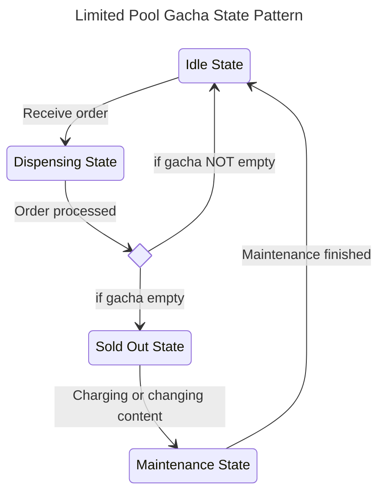
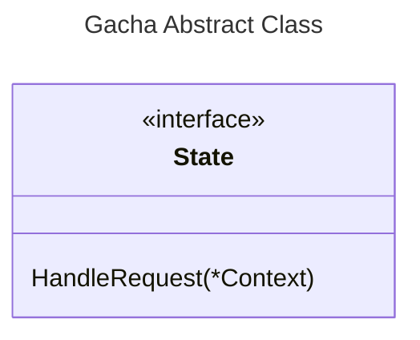
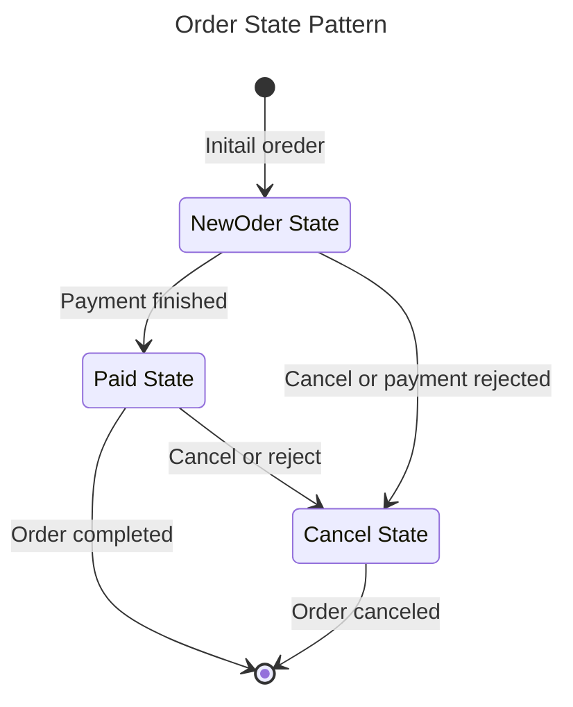

# Limited Pool Gacha Machin State

Practice design of a gacha machine using the state pattern in Go.

## Limited Pool Gacha Diagram

### Gacha State Flow

### Gacha Interface Class

## Order Diagram

If it were official project, please use [Transition](https://github.com/qor/transition) and [GORM](https://github.com/go-gorm/gorm).

